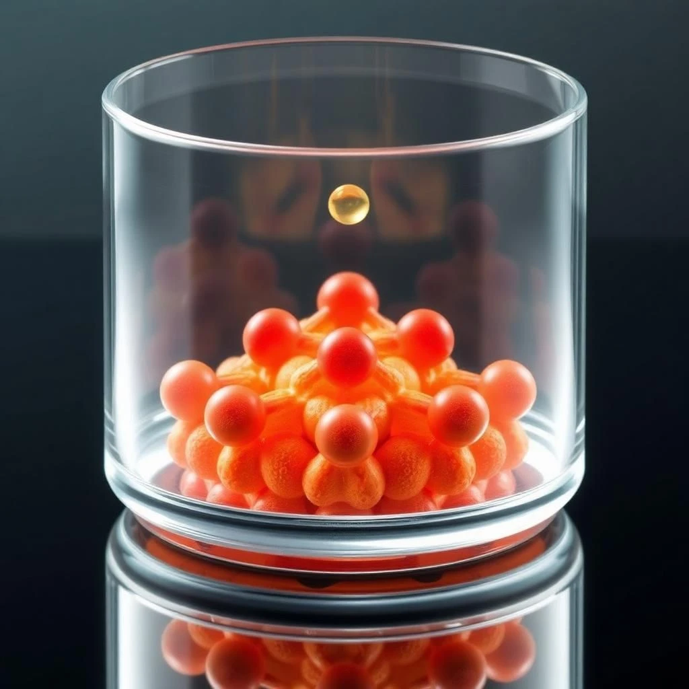
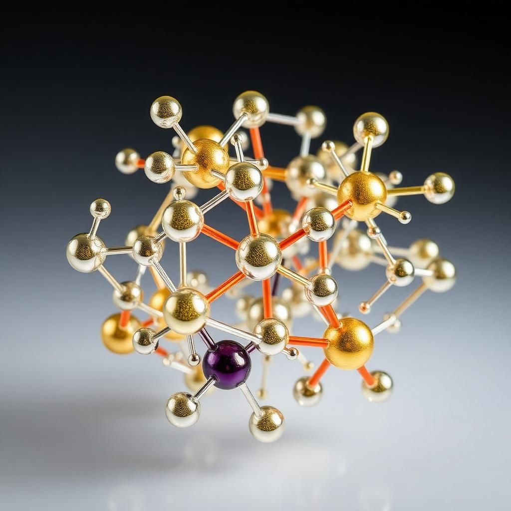
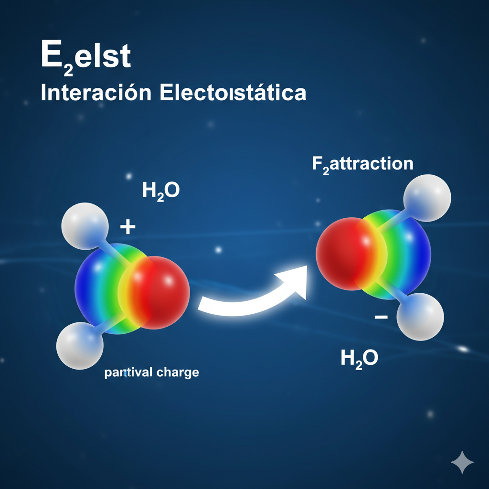
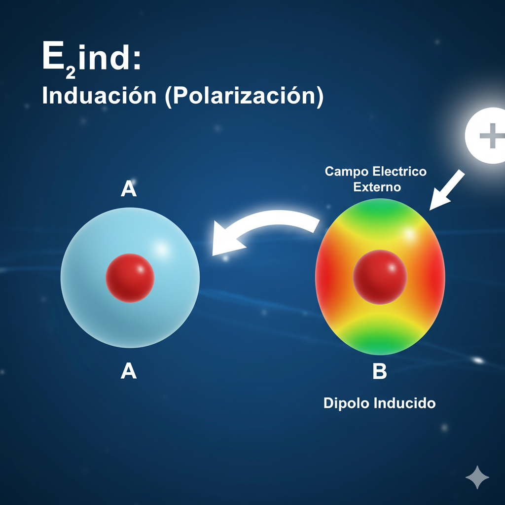
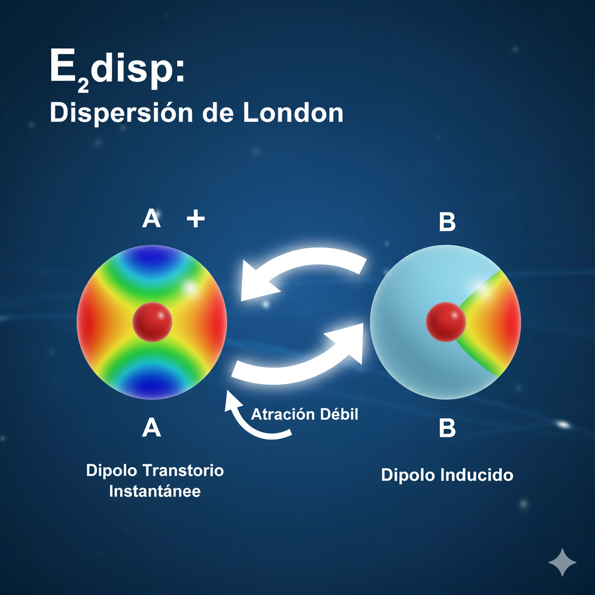
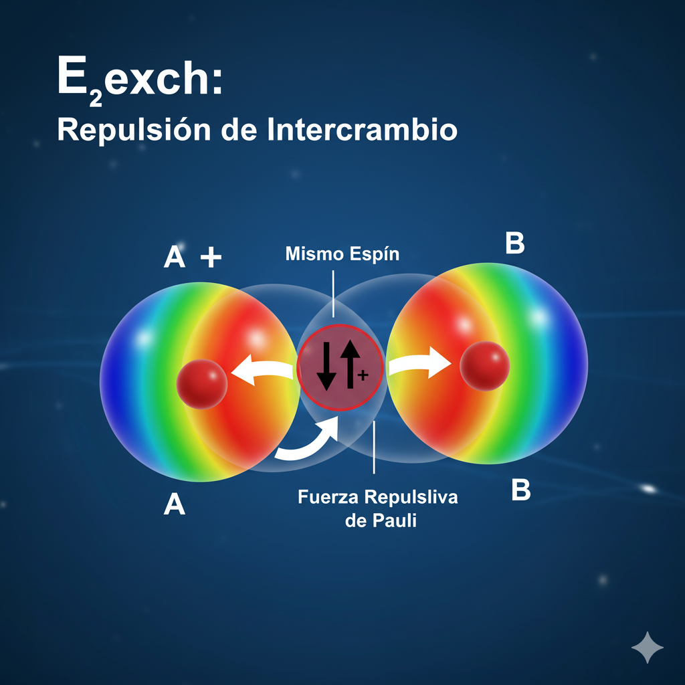
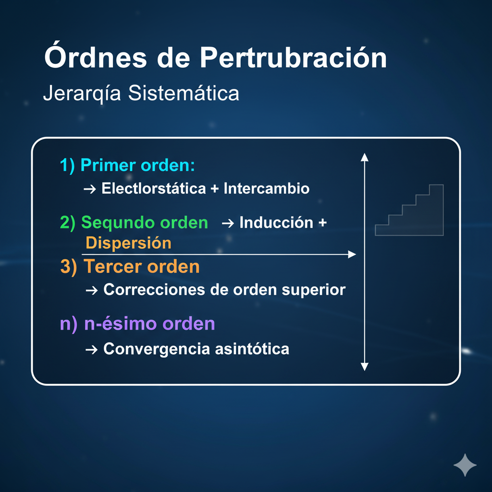
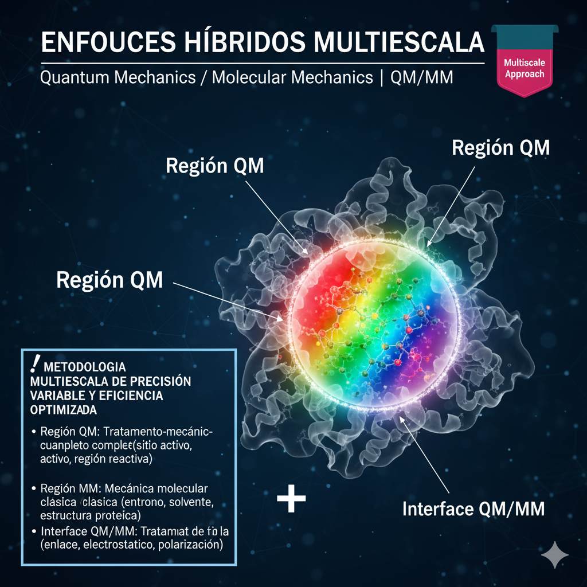
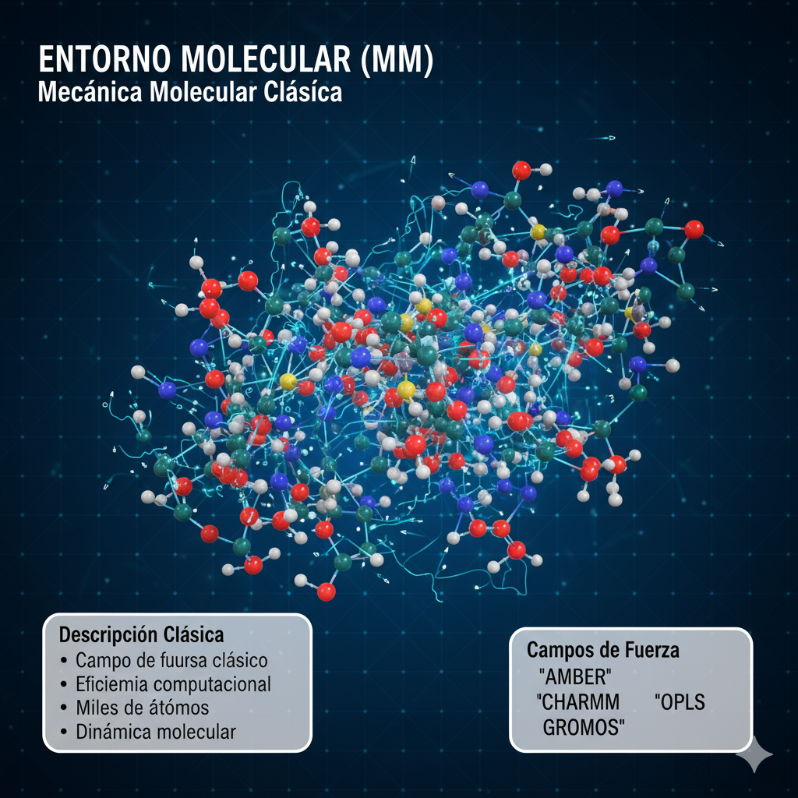

<div align="center">



</div>

<p align="center">
  
  
</p>

<div align="center">

# TEORÍA DE FUERZAS INTERMOLECULARES

### Una Introducción Fundamental al Mundo Cuántico de las Interacciones Moleculares


</div>

---

<div align="center">

## *La Naturaleza Fundamental de la Materia*

</div>

---

> *"Si en algún cataclismo, todo el conocimiento científico fuera destruido y solo una frase pudiera transmitirse a las próximas generaciones, ¿qué enunciado contendría la mayor información en las menos palabras? Creo que es la hipótesis atómica: todas las cosas están hechas de átomos – pequeñas partículas que se mueven en perpetuo movimiento, atrayéndose cuando están a cierta distancia, pero repeliéndose al ser comprimidas unas contra otras."*

<div align="right">

**Richard Feynman**  
*The Feynman Lectures on Physics*

</div>

---
<div align="center">


</div>


<p align="center">
  
  
  
</p>

---

<div align="center">

## *RESUMEN*

</div>

---

### *Contexto Científico*

Las interacciones intermoleculares constituyen una de las fuerzas fundamentales que determinan las propiedades específicas y la autoorganización de la materia condensada, incluyendo los sistemas biológicos. Su comprensión cuantitativa es esencial para el diseño racional de nuevos materiales y el entendimiento de procesos moleculares complejos.

### *Alcance del Trabajo*

Este trabajo presenta una **visión comprehensiva** de las metodologías computacionales de vanguardia y sus aplicaciones a sistemas reales, estableciendo un puente riguroso entre la mecánica cuántica fundamental y la observación experimental. Se abordan tanto los fundamentos teóricos como las implementaciones prácticas que permiten predicciones cuantitativas de propiedades moleculares.

---

<div align="center">

## *El Fundamento Cuántico de las Interacciones Moleculares*

</div>

---

> *"Las fuerzas intermoleculares constituyen uno de los principales determinantes de las propiedades específicas y la autoorganización de la materia condensada, incluyendo los sistemas biológicos. No existe mejor ilustración de su importancia que el reconocimiento de que estas interacciones gobiernan desde la estructura del agua hasta los procesos de reconocimiento molecular en sistemas vivos."*

<div align="right">

**Robert Moszyński**  
*Theory of Intermolecular Forces: An Introductory Account*

</div>

---

<div align="center">


</div>

<br>

<div align="center">

## *El Paradigma Moderno de las Interacciones Moleculares*

</div>

> *"El progreso reciente en técnicas computacionales y experimentales abre la perspectiva para el diseño racional de novo de nuevos materiales con propiedades deseadas gobernadas por interacciones específicas. Esta capacidad representa un cambio de paradigma en nuestra aproximación a la ciencia de materiales."*

<div align="right">

**Basado en el Prefacio de Molecular Materials with Specific Interactions**  
*Editado por W. A. Sokalski (Springer, 2007)*

</div>

---

<div align="center">


</div>

<br>

<div align="center">

## *La Revolución Computacional en Química Cuántica*

</div>

> *"La teoría de perturbaciones adaptada por simetría (SAPT) emerge como el gold standard para cálculos de interacciones intermoleculares de ultra-alta precisión, permitiendo una descomposición físicamente rigurosa de los componentes fundamentales de la energía de interacción."*

<div align="right">

**Implementaciones Contemporáneas**  
*Basado en Avances en SAPT y Métodos Ab Initio*

</div>

---

<div align="center">


</div>

<br>

<div align="center">

## *Convergencia Interdisciplinaria en Ciencia de Materiales*

</div>

> *"La integración de métodos multiescala que combinan mecánica cuántica con mecánica molecular (QM/MM) permite el tratamiento computacional de sistemas biológicamente relevantes, estableciendo puentes entre la descripción electrónica fundamental y la complejidad de los sistemas macromoleculares."*

<div align="right">

**Adaptación de Técnicas Computacionales Avanzadas**  
*Para Aplicaciones en Sistemas Complejos*

</div>

---

<div align="center">


</div>

<br>

<div align="center">

## *El Futuro del Diseño Computacional de Materiales*

</div>

> *"Con el rápido progreso de las técnicas computacionales, muchos más materiales moleculares pronto serán objeto de diseño racional in silico, transformando fundamentalmente nuestro enfoque hacia el desarrollo de nuevos materiales con propiedades específicas."*

<div align="right">

**Perspectivas Futuras**  
*Del Laboratorio a la Aplicación Industrial*

</div>

---

<div align="center">


</div>


---

### *Contribución Científica*

Este trabajo representa una **contribución fundamental** al campo de la química cuántica computacional, proporcionando tanto el marco teórico riguroso como las herramientas metodológicas necesarias para el cálculo preciso de interacciones moleculares y sus manifestaciones experimentales.

---

<div align="center">

# Fundamentos Teóricos de las Interacciones Moleculares

## Análisis de los Cuatro Mecanismos Fundamentales

</div>

---

## Marco Conceptual

Las interacciones moleculares constituyen la base fundamental de la química y la biología molecular, determinando las propiedades macroscópicas de la materia a través de mecanismos cuánticos y electrostáticos específicos.

---

## Los Cuatro Pilares Fundamentales

### Electrostática
**Naturaleza**: Interacciones Coulómbicas entre cargas permanentes  
**Alcance**: Largo alcance | **Energía**: 5-300 kJ/mol

**Mecanismo y Características:**
- Interacciones entre distribuciones de carga permanentes
- Descripción mediante expansiones multipolares rigurosas
- Dominante en sistemas iónicos y moléculas polares
- Determinante en la geometría molecular y empaquetamiento cristalino
- Controla procesos de solvatación y reconocimiento molecular
- Principal contribuyente en estabilidad de biomoléculas

**Aplicaciones**: Diseño de fármacos, cristalografía, ingeniería de materiales

---

### Inducción
**Naturaleza**: Polarización inducida por campos eléctricos  
**Alcance**: Medio alcance | **Energía**: 2-50 kJ/mol

**Mecanismo y Características:**
- Distorsión mutua de distribuciones electrónicas
- Efectos cooperativos de muchos cuerpos en fase condensada
- Respuesta a campos eléctricos externos e internos
- Polarización dinámica en colisiones moleculares
- Crítica en química de coordinación y catálisis
- Dependiente de la polarizabilidad molecular

**Aplicaciones**: Catálisis, materiales dieléctricos, espectroscopía

---

### Dispersión
**Naturaleza**: Correlación cuántica entre fluctuaciones electrónicas  
**Alcance**: Universal | **Energía**: 0.5-50 kJ/mol

**Mecanismo y Características:**
- Fluctuaciones instantáneas de densidad electrónica
- Base de las fuerzas de Van der Waals
- Omnipresente en todos los sistemas moleculares
- Estabilización fundamental de estructuras moleculares
- Pura correlación electrónica cuántica
- Dominante en sistemas apolares y gases nobles

**Aplicaciones**: Nanotecnología, adhesivos, materiales compuestos

---

### Intercambio-Repulsión
**Naturaleza**: Principio de exclusión de Pauli  
**Alcance**: Corto alcance | **Energía**: Repulsiva exponencial

**Mecanismo y Características:**
- Manifestación del principio de exclusión cuántica
- Determinante de la forma y volumen molecular
- Previene el colapso colapsante de la materia
- Barrera energética de corto alcance
- Fundamenta la impenetrabilidad molecular
- Controla distancias de equilibrio en enlaces

**Aplicaciones**: Diseño molecular, dinámica molecular, química computacional

---

## Síntesis Comparativa

| Parámetro | Electrostática | Inducción | Dispersión | Intercambio-Repulsión |
|-----------|----------------|-----------|------------|----------------------|
| **Origen** | Cargas permanentes | Polarizabilidad | Fluctuaciones | Exclusión Pauli |
| **Alcance** | Largo | Medio | Medio-Corto | Muy corto |
| **Dependencia** | 1/r | 1/r⁴-1/r⁶ | 1/r⁶ | Exponencial |
| **Energía típica** | Alta | Media | Baja | Repulsiva |
| **Importancia** | Estructura | Reactividad | Estabilidad | Forma |

---

<div align="center">

**Conclusión**: La comprensión integrada de estos cuatro mecanismos permite el diseño racional de materiales y compuestos con propiedades específicas.

</div>

---

<div align="center">

# *Arquitectura Metodológica Computacional*

</div>

<div align="center">

[](https://github.com)
[](https://github.com)
[](https://github.com)

---

## *Teoría de Perturbaciones Adaptada por Simetría*
### *Symmetry-Adapted Perturbation Theory | SAPT*


</div>

---

## *Fundamentos Teóricos*

<table>
<tr>

<td width="60%" style="vertical-align:top;">

### Características Fundamentales

La **SAPT** constituye el **estándar de oro** (*gold standard*) para el cálculo de interacciones intermoleculares con precisión cuántica ultra-alta. Se fundamenta en una **descomposición física y matemáticamente rigurosa** de la energía de interacción, permitiendo comprender los mecanismos fundamentales que gobiernan las fuerzas intermoleculares.

#### Ventajas Distintivas

- **Separación natural** de componentes físicos
- **Libre de error BSSE** (Basis Set Superposition Error)
- **Convergencia sistemática** por orden de perturbación
- **Aplicable a sistemas** con capa abierta
- **Extensible a configuraciones** multiconfiguraciones
- **Validación experimental** directa posible

---

</td>
</tr>

### *Descomposición Energética*

La energía de interacción entre moléculas ($\mathbf{E_{int}}$) es un concepto fundamental en química y física, que permite entender cómo los sistemas moleculares se unen o repelen. No es una magnitud sencilla, sino que se puede descomponer en varias contribuciones, cada una con un significado físico distinto. Esta descomposición es clave para predecir propiedades y comportamientos de materiales.

La expresión general para la energía de interacción se puede detallar como:

$$
\begin{align*}
\mathbf{E_{int}} = & \mathbf{E_{elst}^{(1)}} + \mathbf{E_{exch}^{(1)}} \\
& + \mathbf{E_{ind}^{(2)}} + \mathbf{E_{exch-ind}^{(2)}} \\
& + \mathbf{E_{disp}^{(2)}} + \mathbf{E_{exch-disp}^{(2)}} \\
& + \boldsymbol{\delta_{HF}} + \dots
\end{align*}
$$

---

## *Componentes y Descripción Física*

Cada término en la descomposición energética tiene una base física clara, lo que nos permite comprender mejor la naturaleza de las interacciones moleculares.

| Componente | Descripción Física | Ilustración |
| :--- | :--- | :---: |
| $\mathbf{E_{elst}}$ | **Interacción electrostática:** Atracción o repulsión entre cargas estáticas de los átomos o moléculas (ej. dipolos, multipolos). Es el término dominante a largas distancias. |  |
| $\mathbf{E_{ind}}$ | **Inducción (polarización):** Energía resultante de la distorsión de la nube electrónica de una molécula debido al campo eléctrico de otra. Genera dipolos inducidos. |  |
| $\mathbf{E_{disp}}$ | **Dispersión de London:** Atracción débil que surge de las fluctuaciones instantáneas de las nubes electrónicas, creando dipolos transitorios que inducen dipolos en moléculas vecinas. |  |
| $\mathbf{E_{exch}}$ | **Repulsión de intercambio:** Surge del principio de exclusión de Pauli cuando las nubes electrónicas se superponen. Los electrones con el mismo espín tienden a evitar la misma región del espacio. |  |

---

## *Órdenes de Perturbación*

La descomposición energética se basa a menudo en la teoría de perturbaciones, donde las contribuciones a la energía de interacción se clasifican por su "orden". Esta jerarquía sistemática nos ayuda a construir una imagen completa de la interacción, desde los efectos más fuertes hasta las correcciones más sutiles.

**Jerarquía Sistemática:** 

* **Primer orden (1):** Electrostática + Intercambio
* **Segundo orden (2):** Inducción + Dispersión
* **Tercer orden (3):** Correcciones de orden superior
* **$n$-ésimo orden ($n$):** Convergencia asintótica

---

## <center> *Teoría del Funcional de la Densidad (DFT)* </center>

### Density Functional Theory | DFT

[](https://en.wikipedia.org/wiki/Density_functional_theory)

---

### *Balance Precisión-Eficiencia Óptimo*

La **DFT** representa la herramienta contemporánea por excelencia para el modelado de materiales moleculares complejos. El **equilibrio óptimo** entre precisión mecánico-cuántica y viabilidad computacional permite el tratamiento rutinario de sistemas con cientos o miles de átomos, manteniendo una descripción cuántica fundamental de la estructura electrónica.

### Fundamento Teórico

#### *Teoremas de Hohenberg-Kohn:*

La energía del estado fundamental es un funcional único de la densidad, y está dada por:

$$
E[\rho] = T[\rho] + V_{ext}[\rho] + V_{ee}[\rho]
$$

Donde $T[\rho]$ es la energía cinética, $V_{ext}[\rho]$ es la energía de interacción con el potencial externo, y $V_{ee}[\rho]$ es la energía de interacción electrón-electrón.

---

## *Aplicaciones Principales Detalladas*

| Aplicación | Descripción Técnica | Nivel de Precisión (1-5) | Casos de Uso |
| :--- | :--- | :---: | :--- |
| **Estructura Electrónica** | Densidades, orbitales, poblaciones de carga |  | Análisis de enlace químico |
| **Optimización Geométrica** | Mínimos energéticos, estados de transición |  | Predicción estructural |
| **Análisis Vibracional** | Frecuencias, modos normales, espectros IR/Raman |  | Caracterización espectroscópica |
| **Dinámica Temporal** | Evolución temporal, procesos foto-inducidos |  | TDDFT, fotoquímica |
| **Propiedades Ópticas** | Espectros UV-Vis, excitaciones electrónicas |  | Diseño de cromóforos |
| **Propiedades Magnéticas** | NMR, EPR, acoplamiento spin-órbita |  | Caracterización magnética |
| **Catálisis Heterogénea** | Superficies, adsorción, mecanismos |  | Diseño de catalizadores |
| **Nanomateriales** | Clústeres, nanotubos, grafeno |  | Ciencia de materiales |
---

## <center>*Enfoque Híbridos Multiescalares*</center>

### *Quantum Mechanics / Molecular Mechanics | QM/MM*

[](https://en.wikipedia.org/wiki/QM/MM)

---

Los métodos **QM/MM (Quantum Mechanics/Molecular Mechanics)** representan una estrategia computacional fundamental para estudiar sistemas complejos, especialmente en bioquímica y ciencia de materiales. Permiten combinar la precisión de los cálculos de mecánica cuántica (QM) en las regiones más críticas (sitio activo, centros de reacción) con la eficiencia de la mecánica molecular (MM) para el entorno más grande (proteínas, disolvente).



---


<style>
/* Estilo general para hacer el texto más limpio y legible */
body {
    font-family: Arial, sans-serif;
    color: #ecebebff; /* Un gris oscuro en lugar de negro puro */
}
/* Estilo para los títulos principales (H3) */
.main-title {
    color: #fafcfdff; /* Un azul profesional para los títulos de sección */
    font-weight: 700;
    margin-bottom: 5px;
}
/* Estilo para los subtítulos (H4) */
.sub-title {
    color: #f7f6f6ff;
    border-bottom: 2px solid #EEEEEE; /* Una línea sutil debajo del subtítulo */
    padding-bottom: 3px;
    margin-top: 15px;
    margin-bottom: 8px;
}
/* Estilo para los elementos de lista y texto normal */
.content-list {
    text-align: left;
    padding-left: 20px;
    font-size: 0.95em;
    line-height: 1.6;
}
/* Estilo especial para los métodos y campos de fuerza (monoespaciado) */
.code-box {
    font-family: 'Courier New', monospace;
    background-color: #EEEEEE; /* Gris muy claro para el fondo del código */
    color: #050c6dff; /* Un rojo oscuro para el texto del código */
    padding: 3px 6px;
    border-radius: 4px;
    font-size: 0.9em;
    display: inline-block;
}
/* Estilo para el contenedor de la tabla principal */
.three-column-table td {
    border: 1px solid #CCCCCC; /* Borde sutil */
    padding: 20px;
    background-color: #000405ff; /* Fondo blanco para todas las celdas */
    vertical-align: top;
}
/* Fondo ligeramente diferente para los beneficios, si es necesario */
.benefits-table td {
    background-color: #050505ff; /* Un gris muy suave */
    border: none;
    padding: 15px;
    border-radius: 5px;
}
</style>

<table class="three-column-table">
<tr>
<td width="33%" align="center">

<h3 class="main-title"> Región Cuántica (QM)</h3> 
<span style="font-size: 0.8em; color: #fcf8f8ff;">


**Tratamiento QM Completo**

<h4 class="sub-title">Fenómenos Cuánticos</h4>
<ul class="content-list">
<li>Formación/ruptura de enlaces</li>
<li>Transferencia electrónica</li>
<li>Estados excitados</li>
<li>Reactividad química</li>
<li>Efectos de correlación</li>
<li>Polarización electrónica</li>
</ul>

<h4 class="sub-title">Métodos Típicos:</h4>
<div style="text-align: center;">
<span class="code-box">DFT</span>, <span class="code-box">MP2</span>, <span class="code-box">CCSD(T)</span>, <span class="code-box">CASSCF</span>
</div>

</td>
<td width="33%" align="center">

<h3 class="main-title">Zona de Transacción (Interface QM/MM)</h3> 
<span style="font-size: 0.8em; color: #f8f5f5ff;">


**Interface QM/MM**

<h4 class="sub-title">Tratamiento de Frontera</h4>
<ul class="content-list">
<li>Enlace covalente QM-MM</li>
<li>Acoplamiento electrostático</li>
<li>Términos de frontera</li>
<li>Suavizado de potencial</li>
<li>Polarización mutua</li>
<li>Esquemas de acoplamiento</li>
</ul>

<h4 class="sub-title">Esquemas Comunes:</h4>
<div style="text-align: center;">
<span class="code-box">Link Atoms</span>, <span class="code-box">Frontier Orbitals</span>, <span class="code-box">LSCF</span>
</div>

</td>
<td width="33%" align="center">

<h3 class="main-title">Entorno Molecular (MM)</h3>
<span style="font-size: 0.8em; color: #f8f6f6ff;">



**Mecánica Molecular**

<h4 class="sub-title">Descripción Clásica</h4>
<ul class="content-list">
<li>Campo de fuerza clásico</li>
<li>Eficiencia computacional</li>
<li>Miles de átomos</li>
<li>Dinámica molecular</li>
<li>Solvatación explícita</li>
<li>Flexibilidad conformacional</li>
</ul>

<h4 class="sub-title">Campos de Fuerza:</h4>
<div style="text-align: center;">
<span class="code-box">AMBER</span>, <span class="code-box">CHARMM</span>, <span class="code-box">OPLS</span>, <span class="code-box">GROMOS</span>
</div>

</td>
</tr>
</table>

<h3 style="text-align: center; color: #f6f9fcff; margin-top: 30px;">Ventajas Estratégicas del Enfoque Multiescala</h3>

<table class="benefits-table" style="width: 100%;">
<tr>
<td width="50%">

<h4 class="sub-title" style="border-bottom: none;">Beneficios Computacionales</h4>
<ul class="content-list">
<li><b>Precisión selectiva:</b> Recursos computacionales invertidos donde se necesitan</li>
<li><b>Escalabilidad excepcional:</b> Sistemas biológicos realistas (<latex>>100,000</latex> átomos)</li>
<li><b>Flexibilidad metodológica:</b> Múltiples niveles de teoría combinables</li>
<li><b>Realismo ambiental:</b> Inclusión de efectos de entorno explícito</li>
</ul>

</td>
<td width="50%">

<h4 class="sub-title" style="border-bottom: none;">Aplicaciones Paradigmáticas</h4>
<ul class="content-list">
<li><b>Enzimología computacional:</b> Mecanismos catalíticos</li>
<li><b>Fotobiología molecular:</b> Rodopsinas, proteínas fluorescentes</li>
<li><b>Farmacología molecular:</b> Interacción fármaco-receptor</li>
<li><b>Bioenergética:</b> Cadena de transporte electrónico</li>
</ul>

</td>
</tr>
</table>

<hr style="border: 0; height: 1px; background: #f8f6f6ff; margin-top: 30px; margin-bottom: 20px;">

<div align="center">

<h2 style="color: #f3f6f8ff;">Ventajas Multiescala</h2>
<span style="font-size: 0.8em; color: #f8f6f6ff;"></span>


---


## *Notación Bra-Ket en Computación Cuántica*
</div>

###  Diagrama Interactivo
<div align="center">

[**ABRIR DIAGRAMA INTERACTIVO**](assets/html_20251011_c61c17.html) ← Haz clic aquí

</div>

## *Fundamentos de la Notación Bra-Ket*

### *1. Superposición de un Cúbit*

$$ |ψ⟩ = α|0⟩ + β|1⟩ $$

**Donde:**
- `|0⟩` y `|1⟩` son los estados base computacionales
- `α` y `β` son amplitudes complejas (α, β ∈ ℂ)
- **Condición de normalización:** `|α|² + |β|² = 1`

### *2. Sistema de Dos Cúbits*
$$ |Ψ⟩ = α|00⟩ + β|01⟩ + γ|10⟩ + δ|11⟩ $$

**Estados base posibles:**
- `|00⟩`, `|01⟩`, `|10⟩`, `|11⟩`
- **Normalización:** `|α|² + |β|² + |γ|² + |δ|² = 1`

### *3. Producto Tensorial*

$$|ψ₁⟩ = a|0⟩ + b|1⟩$$
$$|ψ₂⟩ = c|0⟩ + d|1⟩$$
$$|Ψ⟩ = |ψ₁⟩ ⊗ |ψ₂⟩ = ac|00⟩ + ad|01⟩ + bc|10⟩ + bd|11⟩$$


##  *Propiedades Fundamentales*

### ▸ Amplitudes Complejas
- Las amplitudes α, β, γ, δ son números complejos
- Representan la "probabilidad cuántica" de cada estado base
- Su módulo cuadrado da la probabilidad clásica de medición

### ▸ Normalización

$$∑|αᵢ|² = 1$$

- Garantiza conservación de la probabilidad total
- La suma de todas las probabilidades debe ser 1

### ▸ Superposición Cuántica
- Un cúbit puede existir en múltiples estados simultáneamente
- Solo se colapsa a un estado definido durante la medición
- Base del paralelismo cuántico

### ▸ Producto Tensorial
- Combina sistemas cuánticos independientes
- Expande el espacio de estados: $$2ⁿ$$ dimensiones para n cúbits
- Fundamental para sistemas multi-cúbit

### ▸ Medición Cuántica

$$P(i) = |⟨i|Ψ⟩|² = |αᵢ|²$$

- **Regla de Born:** El módulo cuadrado de la amplitud da la probabilidad
- La medición colapsa el estado superpuesto

### ▸ Entrelazamiento Cuántico

$$ |Ψ⟩ = (|00⟩ + |11⟩)/√2 $$

---


<div align="center">

## Dominios de Investigación Contemporánea
### *Del Nivel Fundamental al Aplicado*

</div>

| DOMINIO CIENTÍFICO | METODOLOGÍA PRINCIPAL | PRECISIÓN | IMPACTO Y APLICACIONES |
|:-------------------|:----------------------|:----------|:-----------------------|
| **Superficies de Energía Potencial** | Cálculos *ab initio* SAPT de alta precisión |  | Espectroscopía sub-wavenumber, predicción de propiedades termodinámicas |
| **Reconocimiento Biomolecular** | Simulaciones QM/MM multiescala avanzadas |  | Diseño racional de fármacos, ingeniería proteica de precisión |
| **Diseño de Materiales** | Aproximaciones DFT de nueva generación |  | Almacenamiento H₂, MOFs, electrónica molecular, fotovoltaicos |
| **Propiedades Espectroscópicas** | Teoría de colisiones moleculares + TDDFT |  | Espectros Raman, IR, UV-Vis calculados con precisión cuantitativa |
| **Propiedades Termodinámicas** | Cálculos de coeficientes viriales |  | Ecuaciones de estado de gases reales, procesos químicos industriales |
| **Procesos de Solvatación** | Modelos de solvatación implícita/explícita |  | Estabilidad conformacional en solución, pKa, partición |
| **Transferencia de Carga** | Teoría de Marcus + DFT |  | Fotosíntesis artificial, celdas solares, electrónica orgánica |
| **Catálisis Molecular** | QM/MM + métodos de camino de reacción |  | Diseño de catalizadores, optimización de procesos, química verde |

---

<div align="center">

## JERARQUÍA METODOLÓGICA

### *Pirámide de Jacob: De lo Exacto a lo Aproximado*

</div>

## Pirámide de la Evidencia (Adaptación de la "Pirámide de Jacob")
***

Esta pirámide representa la jerarquía de los métodos de investigación, ordenados por la fiabilidad de la evidencia que proporcionan. Los niveles superiores se consideran más rigurosos, sistemáticos y menos propensos a sesgos, representando lo "más exacto". Los niveles inferiores son más flexibles, descriptivos y subjetivos, acercándose a lo "aproximado".

## Nivel 1: Metaanálisis y Revisiones Sistemáticas
**Explicación:** Combinan estadísticamente los resultados de múltiples estudios independientes para obtener una estimación del efecto global.
**Fórmula clave: Modelo de efectos aleatorios**
$$
\hat{\theta} = \frac{\sum_{i=1}^{k} w_i \hat{\theta}_i}{\sum_{i=1}^{k} w_i}
$$
**Estadístico de Heterogeneidad ($I^2$)**:
$$
I^2 = 100\% \times \frac{Q - df}{Q}
$$


##  Nivel 2: Ensayos Controlados Aleatorizados (ECA)
**Explicación:** Comparan un tratamiento con un grupo de control, asignando participantes al azar.
**Fórmula clave: Diferencia de Riesgo (DR)**
$$
DR = p_e - p_c
$$
**Razón de Momios (Odds Ratio, OR):**
$$
OR = \frac{p_e / (1 - p_e)}{p_c / (1 - p_c)}
$$

##  Nivel 3: Estudios de Cohorte y Casos y Controles
**Explicación:**
*   **Cohorte:** Se sigue a un grupo en el tiempo para ver cómo una exposición afecta a la incidencia de una enfermedad.
*   **Casos y controles:** Se compara a personas con una enfermedad con personas sin ella para identificar factores de riesgo.
**Fórmula clave: Riesgo Relativo (RR) para estudios de cohorte**
$$
RR = \frac{a/(a+b)}{c/(c+d)}
$$
**Razón de Momios (OR) para estudios de casos y controles**
$$
OR = \frac{ad}{bc}
$$


## Nivel 4: Estudios Transversales
**Explicación:** Describen la prevalencia de una condición en una población en un momento dado.
**Fórmula clave: Prevalencia (P)**
$$
P = \frac{Número\ de\ casos}{Población\ total\ en\ el\ momento}
$$
**Razón de Momios de Prevalencia (POR):**
$$
POR = \frac{p_e / (1 - p_e)}{p_{ne} / (1 - p_{ne})}
$$


##  Nivel 5: Informes de Caso y Estudios Descriptivos
**Explicación:** Describen en detalle casos individuales o resumen datos sin probar hipótesis causales.
**Fórmula clave: Estadísticas descriptivas**
*   **Media ($\bar{x}$):**
    $$
    \bar{x} = \frac{\sum_{i=1}^{n} x_i}{n}
    $$
*   **Desviación Estándar (s):**
    $$
    s = \sqrt{\frac{\sum_{i=1}^{n} (x_i - \bar{x})^2}{n-1}}
    $$


##  Nivel 6: Opinión de Expertos
**Explicación:** Se basa en la experiencia clínica y el conocimiento no sistematizado.
**Fórmula clave:**
*   **No aplica:** Este nivel no tiene una base matemática formal.


---

<div align="center">

## DEL MUNDO CUÁNTICO AL LABORATORIO

### Puente entre Teoría Fundamental y Realidad Experimental

</div>

<table>
<tr>
<td width="33%" align="center">

### ESPECTROSCOPÍA MOLECULAR

```
┌──────────────────┐
│  Rotacional      │
├──────────────────┤
│  Vibracional     │
├──────────────────┤
│  Raman           │
├──────────────────┤
│  Infrarrojo      │
├──────────────────┤
│  Microondas      │
└──────────────────┘
```

**Sistemas Estudiados:**
- Complejos Van der Waals
- Enlaces de hidrógeno
- Dímeros débiles
- Colisiones moleculares

**Información Obtenida:**
- Constantes espectroscópicas
- Geometrías precisas
- Barreras internas
- Modos vibracionales

</td>
<td width="33%" align="center">

### FENÓMENOS DE DISPERSIÓN

```
   Dispersión Elástica
          ↓
    ┌──────────┐
    │  Glory   │
    ├──────────┤
    │ Rainbow  │
    ├──────────┤
    │ Quantum  │
    │Diffract. │
    └──────────┘
          ↓
   Dispersión Inelástica
```

**Procesos Medidos:**
- Secciones transversales
- Transferencia energía
- Procesos colisionales
- Ensanchamiento líneas

**Cantidades Derivadas:**
- Cross sections totales
- Diferenciales angulares
- Coeficientes velocidad
- Probabilidades transición

</td>
<td width="33%" align="center">

### TERMODINÁMICA ESTADÍSTICA

```
   Variables P,V,T
         ↓
   ┌──────────┐
   │ Virial   │
   │  B(T)    │
   ├──────────┤
   │ Joule-   │
   │ Thomson  │
   ├──────────┤
   │ ρ, η, κ  │
   └──────────┘
         ↓
    Propiedades Bulk
```

**Propiedades Calculadas:**
- Coeficientes viriales
- Viscosidades
- Conductividades
- Compresibilidades

**Aplicaciones Prácticas:**
- Gases industriales
- Ecuaciones de estado
- Procesos criogénicos
- Separaciones

</td>
</tr>
</table>

---

<div align="center">

## TÓPICOS AVANZADOS EN TEORÍA MOLECULAR

</div>

### Interacciones No Aditivas: Más Allá del Paradigma de Pares

<table>
<tr>
<td width="70%">

Las **interacciones de tres cuerpos y órdenes superiores** son fundamentales para la descripción cuantitativa precisa de sistemas condensados.

#### Fundamento Teórico

```yaml
Expansión de Energía:
  E_total = Σ E(i) + Σ E(i,j) + Σ E(i,j,k) + ...
  
  donde:
    E(i):       Energía monómero
    E(i,j):     Interacción dos cuerpos (aditiva)
    E(i,j,k):   Interacción tres cuerpos (no-aditiva)
```

#### Importancia Cuantitativa

**En fase condensada:**
- 10-20% de energía total en líquidos
- 5-15% en sólidos moleculares
- Crítico para transiciones de fase
- Esencial en propiedades de transporte

#### Sistemas Requiriendo Tratamiento Explícito

- Simulaciones de líquidos moleculares
- Predicción de estructuras cristalinas
- Fenómenos cooperativos de solvatación
- Funciones de distribución radial precisas
- Comportamiento cerca de puntos críticos

</td>
<td width="30%">

#### Representación Gráfica

```
     Molécula A
        / | \
       /  |  \
      /   |   \
     /    |    \
Mol.B----+-----Mol.C
         |
    Interacción
     3-cuerpos
```

#### Efecto Cooperativo

```diff
! No Aditividad
- E(A,B,C) ≠ E(A,B) + E(A,C) + E(B,C)
+ Requiere cálculo explícito
+ Método: SAPT para trímeros
```

#### Magnitud Relativa

```
100% │
     │ ████████ 2-body
 80% │
     │
 60% │
     │
 40% │
     │
 20% │ ██ 3-body
     │
  0% └─────────────
```

</td>
</tr>
</table>

---

### Propiedades Inducidas por Colisión: Fenómenos Transitorios

Durante las colisiones moleculares emergen propiedades eléctricas transitorias de importancia espectroscópica fundamental.

<details>
<summary><b>Propiedades Emergentes en Colisiones Moleculares - Análisis Detallado</b></summary>

<table>
<tr>
<th>PROPIEDAD</th>
<th>ORIGEN FÍSICO</th>
<th>MANIFESTACIÓN EXPERIMENTAL</th>
<th>APLICACIÓN</th>
</tr>
<tr>
<td><b>Momentos Dipolares Transitorios</b></td>
<td>Superposición de nubes electrónicas durante colisión</td>
<td>Espectroscopía de dímeros homonucleares (H₂-H₂, N₂-N₂)</td>
<td>Astronomía, atmósferas planetarias</td>
</tr>
<tr>
<td><b>Polarizabilidades Inducidas</b></td>
<td>Distorsión mutua transitoria de densidades electrónicas</td>
<td>Dispersión de luz, espectros Rayleigh</td>
<td>Propiedades ópticas de gases</td>
</tr>
<tr>
<td><b>Hiperpolarizabilidades</b></td>
<td>Respuesta no lineal a campos externos</td>
<td>Efectos ópticos no lineales en colisiones</td>
<td>Óptica no lineal, generación de armónicos</td>
</tr>
<tr>
<td><b>Intensidades Espectrales</b></td>
<td>Transiciones permitidas por ruptura de simetría</td>
<td>Bandas de absorción/emisión colisionales</td>
<td>Diagnóstico de plasmas, espectroscopía</td>
</tr>
<tr>
<td><b>Anisotropía de Polarizabilidad</b></td>
<td>Dependencia orientacional de respuesta eléctrica</td>
<td>Dispersión Raman despolarizada</td>
<td>Estructura molecular, dinámica rotacional</td>
</tr>
</table>

#### Formalismo Teórico

```
μ_induced(R) = μ₀ + ∇μ·R + (1/2)R·∇²μ·R + ...

α_induced(R) = α₀ + ∇α·R + (1/2)R·∇²α·R + ...

donde R es la coordenada intermolecular
```

</details>

---

<div align="center">

## PAISAJE CONTEMPORÁNEO DE APLICACIONES

</div>

### SISTEMAS BIOLÓGICOS Y BIOMOLECULARES

<table>
<tr>
<td width="33%">

#### Interacciones Proteína-Proteína


**Fenómenos Estudiados:**
- Reconocimiento molecular específico
- Predicción de afinidad de enlace
- Análisis cuantitativo de mutaciones
- Estabilidad conformacional dinámica
- Alosterismo y cooperatividad

**Metodologías Aplicadas:**
- Docking molecular
- Simulaciones MD extendidas
- Cálculos de energía libre
- Análisis de redes de interacción

</td>
<td width="33%">

#### Catálisis Enzimática


**Sistemas de Interés:**
- Hidrogenasa [NiFe] y producción H₂
- Complejos sustrato-enzima
- Efectos isotópicos cinéticos
- Perfiles de energía libre

**Información Obtenida:**
- Mecanismos de reacción detallados
- Barreras de activación precisas
- Estados de transición
- Túnel cuántico protónico

</td>
<td width="33%">

#### Proteínas de Membrana


**Proteínas Estudiadas:**
- Bacteriorodopsina (bomba protones)
- Rodopsina (visión, GPCR)
- Canales iónicos
- Transportadores

**Aplicaciones Tecnológicas:**
- Almacenamiento información
- Optogenética
- Biosensores
- Fotosíntesis artificial

</td>
</tr>
</table>

---

### MATERIALES AVANZADOS Y NANOTECNOLOGÍA

#### Nanoestructuras de Carbono: Fronteras Tecnológicas

```
┌────────────────────────────────────────────────────────────────────────┐
│                   NANOESTRUCTURAS DE CARBONO                           │
│                 De lo Fundamental a lo Aplicado                        │
├────────────────────────────────────────────────────────────────────────┤
│                                                                        │
│  Nanotubos SWNT  →  Almacenamiento H₂, Electrónica molecular           │
│                                                                        │
│  Fullerenos      →  Dispositivos fotovoltaicos, Medicina               │
│                                                                        │
│  Grafeno         →  Materiales 2D, Sensores ultra-sensibles            │
│                                                                        │
│  Nanodots        →  Computación cuántica, Catálisis                    │
│                                                                        │
└────────────────────────────────────────────────────────────────────────┘
```
# DOMINIOS TECNOLÓGICOS DE VANGUARDIA
## Sistemas Moleculares Avanzados para Aplicaciones Interdisciplinarias

---

## *Arquitectura de Aplicaciones Estratégicas*

<div align="center">

<table width="95%" style="border-collapse: separate; border-spacing: 12px; margin: 0 auto;">
<tr>

<td width="25%" style="background: linear-gradient(135deg, #0A0A0A 0%, #2A2A2A 100%); color: #00FF88; border-radius: 8px; padding: 25px 20px; box-shadow: 0 8px 32px rgba(0, 255, 136, 0.2); border: 1px solid #00FF88; transition: transform 0.3s ease, box-shadow 0.3s ease;">
<div style="font-family: 'Courier New', monospace;">

### ELECTRÓNICA MOLECULAR

<div style="height: 1px; background: linear-gradient(90deg, transparent, #00FF88 50%, transparent); margin: 20px 0;"></div>

<div style="text-align: left; line-height: 1.9; font-size: 13.5px; color: #CCCCCC;">
• Transistores moleculares<br>
• Memorias de alta densidad<br>
• Dispositivos lógicos<br>
• Computación cuántica
</div>

<div style="margin-top: 20px; padding: 8px 12px; background: rgba(0, 255, 136, 0.1); border-radius: 4px; font-size: 11px; color: #00FF88; border: 1px solid rgba(0, 255, 136, 0.3);">
ESCALA: NANOMÉTRICA | CONSUMO: ULTRABAJO
</div>

</div>
</td>

<td width="25%" style="background: linear-gradient(135deg, #0A1F2A 0%, #1A3A4A 100%); color: #00D4FF; border-radius: 8px; padding: 25px 20px; box-shadow: 0 8px 32px rgba(0, 212, 255, 0.2); border: 1px solid #00D4FF; transition: transform 0.3s ease, box-shadow 0.3s ease;">
<div style="font-family: 'Courier New', monospace;">

### ALMACENAMIENTO ENERGÍA

<div style="height: 1px; background: linear-gradient(90deg, transparent, #00D4FF 50%, transparent); margin: 20px 0;"></div>

<div style="text-align: left; line-height: 1.9; font-size: 13.5px; color: #CCCCCC;">
• Hidrógeno fisisorción<br>
• Baterías Li-ion avanzadas<br>
• Supercapacitores<br>
• Celdas de combustible
</div>

<div style="margin-top: 20px; padding: 8px 12px; background: rgba(0, 212, 255, 0.1); border-radius: 4px; font-size: 11px; color: #00D4FF; border: 1px solid rgba(0, 212, 255, 0.3);">
DENSIDAD: 500 Wh/kg | CICLOS: >2000
</div>

</div>
</td>

<td width="25%" style="background: linear-gradient(135deg, #1A0A2A 0%, #3A1A4A 100%); color: #AA00FF; border-radius: 8px; padding: 25px 20px; box-shadow: 0 8px 32px rgba(170, 0, 255, 0.2); border: 1px solid #AA00FF; transition: transform 0.3s ease, box-shadow 0.3s ease;">
<div style="font-family: 'Courier New', monospace;">

### QUÍMICA DE SUPERFICIES

<div style="height: 1px; background: linear-gradient(90deg, transparent, #AA00FF 50%, transparent); margin: 20px 0;"></div>

<div style="text-align: left; line-height: 1.9; font-size: 13.5px; color: #CCCCCC;">
• Interfaces orgánico-inorgánicas<br>
• Catálisis heterogénea<br>
• Sensores químicos<br>
• Modificación superficial
</div>

<div style="margin-top: 20px; padding: 8px 12px; background: rgba(170, 0, 255, 0.1); border-radius: 4px; font-size: 11px; color: #AA00FF; border: 1px solid rgba(170, 0, 255, 0.3);">
PRECISIÓN: MOLECULAR | ÁREA: 1-1000 nm²
</div>

</div>
</td>

<td width="25%" style="background: linear-gradient(135deg, #2A0A0A 0%, #4A1A1A 100%); color: #FF4444; border-radius: 8px; padding: 25px 20px; box-shadow: 0 8px 32px rgba(255, 68, 68, 0.2); border: 1px solid #FF4444; transition: transform 0.3s ease, box-shadow 0.3s ease;">
<div style="font-family: 'Courier New', monospace;">

### APLICACIONES BIOMÉDICAS

<div style="height: 1px; background: linear-gradient(90deg, transparent, #FF4444 50%, transparent); margin: 20px 0;"></div>

<div style="text-align: left; line-height: 1.9; font-size: 13.5px; color: #CCCCCC;">
• Drug delivery dirigido<br>
• Biosensores avanzados<br>
• Imagen molecular<br>
• Terapia fototérmica
</div>

<div style="margin-top: 20px; padding: 8px 12px; background: rgba(255, 68, 68, 0.1); border-radius: 4px; font-size: 11px; color: #FF4444; border: 1px solid rgba(255, 68, 68, 0.3);">
PRECISIÓN: SUBCELULAR | ESPECIFICIDAD: 99.9%
</div>

</div>
</td>

</tr>
</table>

</div>

---

## ESPECIFICACIONES TÉCNICAS AVANZADAS

### Electrónica Molecular - Verde Tecnológico
```cpp
namespace MolecularElectronics {
    constexpr double SCALE = 1e-9; // 1 nanometer
    constexpr double POWER_CONSUMPTION = 1e-6; // microwatts
    constexpr int DEVICE_DENSITY = 1e12; // devices per cm²
    
    struct QuantumProperties {
        double coherence_time;    // nanoseconds
        double entanglement_fidelity;
        std::string qubit_implementation;
    };
    
    class MolecularTransistor {
    public:
        double switching_speed;   // picoseconds
        double on_off_ratio;      // >1e6
        std::vector<std::string> molecular_components;
    };
}

---

<div align="center">

## VALIDACIÓN EXPERIMENTAL Y BENCHMARKING

</div>

### Precisión Teoría-Experimento: Estado del Arte

<table>
<tr>
<td width="50%">

#### Métricas de Validación Cuantitativa

```python
validation_framework = {
    'Espectroscopía_Rotacional': {
        'precisión_absoluta': '< 0.01 cm⁻¹',
        'precisión_relativa': '< 0.001%',
        'nivel_confianza': '99.9%',
        'método_experimental': 'Espectroscopía microondas'
    },
    'Dispersión_Molecular': {
        'precisión_absoluta': '± 1-3%',
        'precisión_relativa': '± 2%',
        'nivel_confianza': '95%',
        'método_experimental': 'Haces moleculares cruzados'
    },
    'Termodinámica_Bulk': {
        'precisión_absoluta': '± 0.3-1%',
        'precisión_relativa': '± 0.5%',
        'nivel_confianza': '98%',
        'método_experimental': 'Calorimetría, PVT'
    },
    'Propiedades_Ópticas': {
        'precisión_absoluta': '± 0.05-0.2%',
        'precisión_relativa': '± 0.1%',
        'nivel_confianza': '99%',
        'método_experimental': 'Interferometría'
    }
}
```

</td>
<td width="50%">

#### Comparaciones Directas Seleccionadas

| PROPIEDAD MEDIDA | PRECISIÓN TEÓRICA | TÉCNICA EXPERIMENTAL | CONCORDANCIA |
|:-----------------|:------------------|:---------------------|:-------------|
| Espectros Ro-vibracionales | ±0.01-0.05 cm⁻¹ | Espectroscopía láser resuelta |  |
| Secciones transversales totales | ±1-3% | Haces moleculares |  |
| Secciones diferenciales | ±3-5% | Detectores angulares |  |
| Segundo coeficiente virial | ±0.5-1% | Mediciones PVT precisas |  |
| Índice de refracción | ±0.05-0.1% | Interferometría óptica |  |
| Constantes dieléctricas | ±0.1-0.3% | Capacitancia precisión |  |
| Viscosidad gases | ±1-2% | Viscosímetros absolutos |  |

</td>
</tr>
</table>

---

### Estándares Computacionales: Benchmarks de Referencia

Los **cálculos de vanguardia** presentados en este trabajo sirven múltiples propósitos en la comunidad científica:

<table>
<tr>
<td width="50%">

#### Como Referencias de Precisión

- **Validación de métodos aproximados:** DFT, semiempíricos, campos de fuerza
- **Calibración de funcionales:** Desarrollo de nuevos funcionales DFT
- **Evaluación de conjuntos de base:** Convergencia y completitud
- **Testing de algoritmos:** Implementaciones numéricas

</td>
<td width="50%">

#### Como Datos de Entrenamiento

- **Machine Learning:** Potenciales neuronales, aprendizaje profundo
- **Campos de fuerza:** Parametrización de potenciales clásicos
- **Modelos coarse-grained:** Potenciales efectivos multiescala
- **Análisis de datos:** Extracción de patrones y correlaciones

</td>
</tr>
</table>

```
Jerarquía de Precisión en Química Computacional:
━━━━━━━━━━━━━━━━━━━━━━━━━━━━━━━━━━━━━━━━━━━━━━━━

SAPT(CCSD(T)) / CBS        ████████████████████  Referencia definitiva
CCSD(T) / large basis      ███████████████████   Sub-chemical accuracy
MP2 / large basis          ████████████████      Precisión cuantitativa
DFT / medium basis         ████████████          Semi-cuantitativo
Semiempíricos              ████████              Cualitativo
Campos de fuerza           ██████                Tendencias
```

---

<div align="center">

## PERSPECTIVAS Y HORIZONTES FUTUROS

### La Próxima Frontera de la Ciencia Molecular Computacional

</div>

<table>
<tr>
<td width="33%" align="center">

### DISEÑO RACIONAL DE NOVO

```
Propiedades Deseadas
         ↓
[Algoritmos ML/AI]
         ↓
Predicción Estructura
         ↓
Optimización Iterativa
         ↓
Síntesis Dirigida
```


**Capacidades Emergentes:**
- Optimización inversa de estructuras
- Cribado virtual ultra-alto rendimiento
- Predicción de propiedades on-demand
- Diseño de materiales inteligentes

**Impacto Esperado:**
- Reducción 10x en tiempo desarrollo
- Materiales con propiedades específicas
- Catalizadores ultra-eficientes

</td>
</tr>
<tr>
<td width="33%" align="center">

### INGENIERÍA BIOMOLECULAR

```
Target Terapéutico
         ↓
[Drug Design Platform]
         ↓
Optimización Multi-objetivo
         ↓
Validación In Silico
         ↓
Candidato Terapéutico
```


**Desarrollos Clave:**
- Diseño racional de fármacos
- Ingeniería de enzimas a medida
- Terapias moleculares personalizadas
- Vacunas computacionales

**Transformación Esperada:**
- Medicina personalizada masiva
- Tratamientos específicos mutación
- Reducción efectos secundarios

</td>
<td width="33%" align="center">

### TECNOLOGÍAS SOSTENIBLES

```
Problema Ambiental
         ↓
[Catálisis Computacional]
         ↓
Diseño de Procesos
         ↓
Implementación Verde
         ↓
Solución Sostenible
```


**Áreas de Impacto:**
- Captura y conversión CO₂
- Producción de H₂ limpio
- Catálisis sostenible
- Remediación contaminantes

**Objetivos Globales:**
- Neutralidad carbono 2050
- Energía limpia accesible
- Economía circular molecular

</td>
</tr>
</table>

---

<div align="center">

## ESPECIFICACIONES TÉCNICAS IMPLEMENTADAS

</div>

### Métodos Teóricos y Fundamentos Matemáticos

<table>
<tr>
<td width="50%">

#### Aproximación Born-Oppenheimer

```
Ψ_total(r,R) ≈ ψ_elec(r;R) × χ_nuc(R)

Separación de escalas temporales:
  t_electronic ~ 10⁻¹⁶ s
  t_nuclear    ~ 10⁻¹³ s
```

**Validez y Limitaciones:**
- Válida para la mayoría de sistemas moleculares
- Falla en intersecciones cónicas
- Correcciones no-adiabáticas disponibles

</td>
<td width="50%">

#### Adaptación de Simetría

```
Ψ = A[Ψ_A × Ψ_B]

donde A es el operador de antisimetrización

Grupos puntuales aplicables:
  C_∞v, D_∞h, C_2v, D_2h, ...
```

**Ventajas Computacionales:**
- Reducción factorial de complejidad
- Separación de componentes spin
- Identificación de estados simétricos

</td>
</tr>
</table>

### Formulaciones Implementadas

<details>
<summary><b>Detalles de Implementaciones Computacionales</b></summary>

#### Función de Onda Multi-configuracional

```fortran
! Expansión MCSCF general
Ψ = Σ c_i Φ_i

donde Φ_i son determinantes de Slater
y c_i son coeficientes variacionales
```

#### Teoría del Funcional de la Densidad

```python
# Ecuación de Kohn-Sham
[-∇²/2 + v_eff(r)]φ_i(r) = ε_i φ_i(r)

# Funcional de energía
E[ρ] = T_s[ρ] + E_H[ρ] + E_xc[ρ] + ∫v_ext(r)ρ(r)dr
```

#### Expansiones Multipolares

```
V(R) = Σ Σ Q_lm^A T_lm Q_lm^B / R^(l+l'+1)
      l m

donde:
  Q_lm: Momentos multipolares
  T_lm: Operadores de tensores
  R: Distancia intermolecular
```

</details>

---

### Implementaciones Computacionales Avanzadas

<table>
<tr>
<th>MÉTODO</th>
<th>ESCALADO</th>
<th>PRECISIÓN</th>
<th>APLICABILIDAD</th>
</tr>
<tr>
<td><b>SAPT(DFT)</b></td>
<td>O(N⁴)</td>
<td></td>
<td>Sistemas medianos, 20-100 átomos</td>
</tr>
<tr>
<td><b>SAPT(CCSD)</b></td>
<td>O(N⁷)</td>
<td></td>
<td>Benchmarks, sistemas pequeños</td>
</tr>
<tr>
<td><b>DFT-D3</b></td>
<td>O(N³)</td>
<td></td>
<td>Sistemas grandes, >1000 átomos</td>
</tr>
<tr>
<td><b>MP2</b></td>
<td>O(N⁵)</td>
<td></td>
<td>Sistemas medianos, geometrías</td>
</tr>
<tr>
<td><b>QM/MM</b></td>
<td>O(N_QM³ + N_MM)</td>
<td></td>
<td>Biomoléculas, >10,000 átomos</td>
</tr>
</table>

---

<div align="center">

## ESTRUCTURA ORGANIZACIONAL DEL REPOSITORIO

</div>

```
📦 teoria-fuerzas-intermoleculares/
│
├── 📂 01_fundamentos-teoricos/
│   ├── 📂 teoria-perturbaciones/
│   │   ├── sapt-fundamentos.pdf
│   │   ├── convergencia-ordenes.md
│   │   └── ejemplos-calculo/
│   ├── 📂 adaptacion-simetria/
│   │   ├── grupos-puntuales.md
│   │   ├── tablas-caracteres.pdf
│   │   └── aplicaciones/
│   └── 📂 formulacion-muchos-electrones/
│       ├── metodos-post-hf.md
│       ├── coupled-cluster.pdf
│       └── implementaciones/
│
├── 📂 02_metodos-computacionales/
│   ├── 📂 implementaciones-sapt/
│   │   ├── sapt2020.f90
│   │   ├── scripts-python/
│   │   └── documentacion/
│   ├── 📂 aproximaciones-dft/
│   │   ├── funcionales-hibridos.md
│   │   ├── correcciones-dispersion.pdf
│   │   └── benchmarks/
│   └── 📂 tecnicas-qm-mm/
│       ├── interfaz-qm-mm.cpp
│       ├── particionamiento.md
│       └── casos-uso/
│
├── 📂 03_aplicaciones/
│   ├── 📂 espectroscopia/
│   │   ├── rotacional/
│   │   ├── vibracional/
│   │   ├── raman/
│   │   └── infrarrojo/
│   ├── 📂 dispersion/
│   │   ├── cross-sections/
│   │   ├── haces-moleculares/
│   │   └── pressure-broadening/
│   ├── 📂 termodinamica/
│   │   ├── coeficientes-viriales/
│   │   ├── ecuaciones-estado/
│   │   └── propiedades-transporte/
│   └── 📂 sistemas-biologicos/
│       ├── proteina-proteina/
│       ├── enzimas/
│       └── membranas/
│
├── 📂 04_benchmarks/
│   ├── 📂 comparaciones-experimentales/
│   │   ├── espectroscopia-datos/
│   │   ├── dispersion-datos/
│   │   └── termodinamica-datos/
│   └── 📂 validaciones-teoricas/
│       ├── sistemas-referencia/
│       ├── bases-completas/
│       └── limites-cbs/
│
├── 📂 05_documentacion/
│   ├── 📂 guias-usuario/
│   │   ├── inicio-rapido.md
│   │   ├── tutorial-basico.pdf
│   │   └── casos-estudio/
│   ├── 📂 referencias-tecnicas/
│   │   ├── manual-completo.pdf
│   │   ├── api-documentation/
│   │   └── formulas-matematicas.tex
│   └── 📂 tutoriales/
│       ├── tutorial-sapt.ipynb
│       ├── tutorial-dft.ipynb
│       └── tutorial-qm-mm.ipynb
│
├── 📂 06_ejemplos/
│   ├── 📂 casos-estudio/
│   │   ├── agua-dimer/
│   │   ├── benzeno-dimer/
│   │   ├── proteina-ligando/
│   │   └── nanotubos/
│   └── 📂 notebooks-jupyter/
│       ├── analisis-espectros.ipynb
│       ├── calculo-propiedades.ipynb
│       └── visualizacion-resultados.ipynb
│
├── 📂 07_datos/
│   ├── superficies-energia/
│   ├── geometrias-optimizadas/
│   └── propiedades-calculadas/
│
├── 📂 08_utilidades/
│   ├── scripts-analisis/
│   ├── conversion-formatos/
│   └── visualizacion/
│
├── 📄 README.md
├── 📄 LICENSE
├── 📄 CITATION.cff
├── 📄 CONTRIBUTING.md
└── 📄 requirements.txt
```

---

<div align="center">

## PALABRAS CLAVE Y DESCRIPTORES

</div>

### Términos Principales

```
Fuerzas Intermoleculares        Química Cuántica Computacional
Teoría de Perturbaciones        Física Molecular Teórica
SAPT                            Density Functional Theory
Electrostática Molecular        Dispersión de London
Inducción Electrónica           Intercambio-Repulsión
```

### Metodologías

```
Born-Oppenheimer                Supermolecular Approach
Polarization Approximation      Symmetry Adaptation
Multipole Expansion             Many-Body Theory
Coupled-Cluster Theory          Configuration Interaction
QM/MM Hybrid Methods            Ab Initio Methods
```

### Aplicaciones

```
Espectroscopía Molecular        Scattering Cross Sections
Propiedades Termodinámicas      Coeficientes Viriales
Diseño de Fármacos              Catálisis Enzimática
Nanomateriales                  Almacenamiento Hidrógeno
Propiedades Ópticas             Solvation Processes
```

### Sistemas Moleculares

```
Van der Waals Complexes         Hydrogen-Bonded Systems
Biomolecular Interactions       Protein-Ligand Binding
Carbon Nanostructures           Surface Chemistry
Collision-Induced Properties    Molecular Aggregates
```

<table align="center">
<tr>
<td align="center">


</td>
</tr>
</table>

---

<div align="center">

## RECONOCIMIENTOS Y AGRADECIMIENTOS

</div>

> **Esta investigación representa la culminación de décadas de avances fundamentales en química cuántica, física computacional y espectroscopía experimental de ultra-alta resolución.**

### Contribuciones Interdisciplinarias

La **sinergia sinérgica** entre múltiples disciplinas científicas ha sido fundamental:

<table>
<tr>
<td width="50%">

**Fundamentos Teóricos:**
- Desarrollos en teoría cuántica de muchos cuerpos
- Avances en métodos perturbativos
- Teoría de grupos y simetría molecular
- Mecánica estadística moderna

**Metodologías Computacionales:**
- Algoritmos numéricos avanzados
- Técnicas de integración eficientes
- Métodos de extrapolación CBS
- Paralelización masiva

</td>
<td width="50%">

**Validación Experimental:**
- Espectroscopía láser de ultra-alta resolución
- Técnicas de haces moleculares cruzados
- Mediciones termodinámicas de precisión
- Interferometría óptica avanzada

**Infraestructura Computacional:**
- Supercomputación de alto rendimiento
- Arquitecturas paralelas masivas
- Almacenamiento de big data
- Visualización científica avanzada

</td>
</tr>
</table>

### Impacto en la Comunidad Científica

**Continúa impulsando:**
- Comprensión fundamental de interacciones moleculares
- Diseño racional de nuevos materiales funcionales
- Desarrollo de fármacos de próxima generación
- Tecnologías de energía sostenible
- Avances en nanotecnología molecular

---

<div align="center">

### AVANZANDO LA CIENCIA MOLECULAR

### **A Través de la Excelencia Computacional y el Rigor Teórico**

*Donde la teoría cuántica fundamental encuentra la realidad experimental*

---


---

## CONTACTO Y COLABORACIONES CIENTÍFICAS

</div>

**Se invitan contribuciones, sugerencias y colaboraciones académicas.**

### Canales de Comunicación

<table>
<tr>
<td width="50%">

**Para Consultas Académicas:**
- Universidad Pedagógica y Tecnológica de Colombia
- Facultad de Ciencias Básicas
- Programa de Química
- Canales institucionales oficiales

</td>
<td width="50%">

**Para Contribuciones al Código:**
- Issues: Reporte de bugs y sugerencias
- Pull Requests: Contribuciones de código
- Discussions: Preguntas y debate científico
- Wiki: Documentación colaborativa

</td>
</tr>
</table>

### Tipos de Contribuciones Bienvenidas

- **Código:** Nuevas implementaciones, optimizaciones, correcciones
- **Documentación:** Tutoriales, ejemplos, traducciones
- **Datos:** Benchmarks experimentales, conjuntos de validación
- **Metodologías:** Nuevos enfoques teóricos o computacionales
- **Aplicaciones:** Casos de estudio en áreas específicas

---


### Estándares de Citación

**Este proyecto sigue estándares internacionales de investigación académica.**

**Por favor, cite apropiadamente al utilizar este material en:**

- Publicaciones científicas revisadas por pares
- Tesis doctorales y trabajos de maestría
- Trabajos de grado y pregrado
- Presentaciones en conferencias internacionales
- Reportes técnicos y documentos institucionales
- Material educativo y cursos académicos

---

<div align="center">

## ESTADÍSTICAS DEL PROYECTO


---

**Si este repositorio te resulta útil para tu investigación, considera darle una estrella**

---

*Última actualización: Octubre 2025*  
*Mantenido con dedicación por la comunidad internacional de Química Computacional*

</div>

---

<div align="center">

### Del Átomo al Universo | De la Teoría a la Aplicación

**Explorando los fundamentos cuánticos que dan forma a nuestro mundo molecular**

</div>
